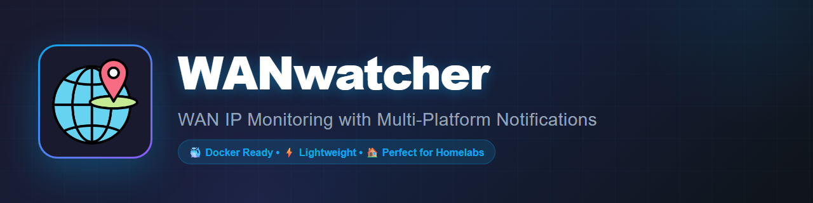

<div align="center">



</div>

# 🌐 WANwatcher

### WAN IP Monitoring with Discord Notifications

[](https://www.python.org/)
[](https://hub.docker.com/r/noxied/wanwatcher)
[](https://discord.com/)
[](LICENSE)

**Monitor your WAN IP address and receive beautiful Discord notifications when it changes!**

[Features](#-features) • [Quick Start](#-quick-start) • [Installation](#-installation) • [Configuration](#-configuration) • [Documentation](#-documentation)

---

</div>

## 📸 Preview

### Discord Notification Example

<div align="left">

</div>

**Example notification you'll receive:**
```
🌐 WAN IP Monitor Alert
━━━━━━━━━━━━━━━━━━━━━
🔄 IP Address Changed
WAN IP for My Server has been updated

📍 Current IP: 98.76.54.32
📌 Previous IP: 123.45.67.89

🌍 Location Information
└─ 🗺️ Los Angeles, CA, United States
└─ 🏢 Example Internet Provider
└─ 🕐 America/Los_Angeles

⏰ Detected At
└─ Saturday, October 25, 2025 3:15 AM

🐳 Environment
└─ Running in Docker
━━━━━━━━━━━━━━━━━━━━━
WANwatcher on My Server
```

---

## 🎯 Overview

**WANwatcher** is a lightweight, self-hosted solution for monitoring your WAN IP address with automatic Discord notifications. Perfect for home labs, dynamic IPs, and remote servers.

### Why WANwatcher?

- 🏠 **Perfect for Home Labs** - Track your dynamic IP effortlessly
- 🔔 **Instant Notifications** - Know immediately when your IP changes
- 🌍 **Geographic Details** - See city, country, ISP, and timezone
- 🛡️ **Reliable** - Multiple fallback IP detection services
- 📝 **Well Logged** - Complete activity tracking
- ⚡ **Lightweight** - Minimal resource usage (~50-60MB RAM)
- 🐳 **Docker Ready** - Deploy as a container or traditional script

---

## ✨ Features

### Core Features
- ✅ Automatic IP monitoring with change detection
- ✅ Rich Discord webhook notifications with embeds
- ✅ Optional geographic information (city, country, ISP, timezone)
- ✅ Multiple fallback IP detection services
- ✅ Detailed logging and error reporting
- ✅ Two deployment options: Docker or Traditional

### Technical Features
- 🐍 Python 3.7+ compatible
- 🔄 Configurable check intervals
- 🌐 IPv4 support
- 📊 Historical IP tracking
- 🔐 Secure webhook integration
- 🚀 Low resource usage
- 📱 Mobile-friendly Discord notifications

---

## ⚡ Quick Start

### Option 1: Docker (Recommended - 5 minutes)

```bash
# Pull from Docker Hub
docker pull noxied/wanwatcher:latest

# Run with your Discord webhook
docker run -d \
  --name wanwatcher \
  --restart unless-stopped \
  -e DISCORD_WEBHOOK_URL="https://discord.com/api/webhooks/YOUR_ID/YOUR_TOKEN" \
  -e SERVER_NAME="My Server" \
  -v $(pwd)/data:/data \
  -v $(pwd)/logs:/logs \
  noxied/wanwatcher:latest
```

**Using Docker Compose:**

```yaml
version: '3.8'
services:
  wanwatcher:
    image: noxied/wanwatcher:latest
    container_name: wanwatcher
    restart: unless-stopped
    environment:
      DISCORD_WEBHOOK_URL: "https://discord.com/api/webhooks/YOUR_ID/YOUR_TOKEN"
      SERVER_NAME: "My Server"
      CHECK_INTERVAL: "900"  # 15 minutes
    volumes:
      - ./data:/data
      - ./logs:/logs
```

### Option 2: Traditional Installation (15 minutes)

```bash
# Clone repository
git clone https://github.com/noxied/wanwatcher.git
cd wanwatcher

# Run installation script
chmod +x scripts/install.sh
sudo ./scripts/install.sh

# The installer will guide you through configuration
```

---

## 📋 Table of Contents

- [Installation](#-installation)
  - [Docker Installation](#docker-installation)
  - [Traditional Installation](#traditional-installation)
- [Configuration](#-configuration)
- [Usage](#-usage)
- [Platform-Specific Guides](#-platform-specific-guides)
- [Troubleshooting](#-troubleshooting)
- [Contributing](#-contributing)
- [Support](#-support)

---

## 🚀 Installation

### Prerequisites

**For Docker:**
- Docker Engine 20.10+ or Docker Desktop
- Docker Compose 1.29+ (optional)

**For Traditional:**
- Linux-based system
- Python 3.7+
- Internet connectivity

### Discord Webhook Setup

1. Open Discord → Server Settings → Integrations → Webhooks
2. Click "Create Webhook"
3. Name it (e.g., "WANwatcher")
4. Select channel for notifications
5. Copy webhook URL
6. Save changes

---

## 🐳 Docker Installation

### Method 1: Docker Compose (Recommended)

**Step 1: Create docker-compose.yml**

```yaml
version: '3.8'

services:
  wanwatcher:
    image: noxied/wanwatcher:latest
    container_name: wanwatcher
    restart: unless-stopped
    
    environment:
      # Required: Your Discord webhook URL
      DISCORD_WEBHOOK_URL: "https://discord.com/api/webhooks/YOUR_WEBHOOK_ID/YOUR_TOKEN"
      
      # Optional: ipinfo.io API token for geographic data
      IPINFO_TOKEN: ""
      
      # Optional: Server identification
      SERVER_NAME: "My Server"
      
      # Optional: Check interval in seconds (default: 900 = 15 minutes)
      CHECK_INTERVAL: "900"
      
      # Optional: Discord bot name
      BOT_NAME: "WANwatcher"
    
    volumes:
      - ./data:/data
      - ./logs:/logs
    
    # Optional: Resource limits
    deploy:
      resources:
        limits:
          cpus: '0.5'
          memory: 128M
```

**Step 2: Deploy**

```bash
docker-compose up -d
```

**Step 3: Verify**

```bash
docker-compose logs -f
```

### Method 2: Docker Run

```bash
docker run -d \
  --name wanwatcher \
  --restart unless-stopped \
  -e DISCORD_WEBHOOK_URL="https://discord.com/api/webhooks/YOUR_ID/YOUR_TOKEN" \
  -e SERVER_NAME="My Server" \
  -e CHECK_INTERVAL="900" \
  -v $(pwd)/data:/data \
  -v $(pwd)/logs:/logs \
  noxied/wanwatcher:latest
```

### Docker Management Commands

```bash
# Start
docker-compose up -d

# Stop
docker-compose down

# Restart
docker-compose restart

# View logs
docker-compose logs -f

# Check status
docker-compose ps

# Update to latest version
docker-compose pull
docker-compose up -d
```

---

## 💻 Traditional Installation

### Automated Installation

**Step 1: Clone repository**

```bash
git clone https://github.com/noxied/wanwatcher.git
cd wanwatcher
```

**Step 2: Run installer**

```bash
chmod +x scripts/install.sh
sudo ./scripts/install.sh
```

The installer will:
- Check system requirements
- Install Python dependencies
- Copy scripts to `/root/wanwatcher/`
- Guide you through configuration
- Optionally set up automatic monitoring with cron

**Step 3: Configure**

Edit the configuration file:

```bash
sudo nano /root/wanwatcher/wanwatcher.py
```

Update these variables:

```python
DISCORD_WEBHOOK_URL = "https://discord.com/api/webhooks/YOUR_ID/YOUR_TOKEN"
SERVER_NAME = "My Server"
IPINFO_TOKEN = ""  # Optional - get from ipinfo.io
```

**Step 4: Test**

```bash
python3 /root/wanwatcher/wanwatcher.py
```

You should see log output and receive a Discord notification!

**Step 5: Set up automation (if not done by installer)**

```bash
crontab -e
```

Add this line to check every 15 minutes:

```bash
*/15 * * * * /usr/bin/python3 /root/wanwatcher/wanwatcher.py >> /var/log/wanwatcher-cron.log 2>&1
```

**Other intervals:**

```bash
*/5 * * * *   # Every 5 minutes
*/30 * * * *  # Every 30 minutes
0 * * * *     # Every hour
```

### Manual Installation

If you prefer manual installation:

```bash
# Create directories
sudo mkdir -p /root/wanwatcher /var/lib/wanwatcher

# Copy script
sudo cp wanwatcher.py /root/wanwatcher/
sudo chmod +x /root/wanwatcher/wanwatcher.py

# Install dependencies
pip3 install requests --break-system-packages

# Or use the provided script
chmod +x scripts/install-requests.sh
sudo ./scripts/install-requests.sh

# Configure and test (same as automated installation)
```

---

## ⚙️ Configuration

### Environment Variables (Docker)

| Variable | Required | Default | Description |
|----------|----------|---------|-------------|
| `DISCORD_WEBHOOK_URL` | ✅ Yes | - | Your Discord webhook URL |
| `IPINFO_TOKEN` | No | `""` | ipinfo.io API token for geo data |
| `SERVER_NAME` | No | `"My Server"` | Server identifier in notifications |
| `CHECK_INTERVAL` | No | `900` | Check interval in seconds |
| `BOT_NAME` | No | `"WANwatcher"` | Discord bot username |

### Script Variables (Traditional)

Edit `/root/wanwatcher/wanwatcher.py`:

```python
# Required
DISCORD_WEBHOOK_URL = "https://discord.com/api/webhooks/..."

# Optional
IPINFO_TOKEN = ""                                  # ipinfo.io token
SERVER_NAME = "My Server"                          # Server name
BOT_NAME = "WANwatcher"                            # Bot name
IP_DB_FILE = "/var/lib/wanwatcher/ipinfo.db"      # IP storage
LOG_FILE = "/var/log/wanwatcher.log"              # Log file
```

### Check Interval Examples

**Docker:**
```yaml
environment:
  CHECK_INTERVAL: "300"   # 5 minutes
  CHECK_INTERVAL: "900"   # 15 minutes (recommended)
  CHECK_INTERVAL: "1800"  # 30 minutes
  CHECK_INTERVAL: "3600"  # 1 hour
```

**Traditional (cron):**
```bash
*/5 * * * *   # Every 5 minutes
*/15 * * * *  # Every 15 minutes (recommended)
*/30 * * * *  # Every 30 minutes
0 * * * *     # Every hour
```

### Getting ipinfo.io Token (Optional)

For geographic information:

1. Visit https://ipinfo.io/signup
2. Create free account (50,000 requests/month)
3. Copy access token
4. Add to configuration

**Without token:** Basic IP detection still works  
**With token:** Adds city, country, ISP, and timezone information

---

## 🎮 Usage

### Docker Commands

```bash
# View real-time logs
docker logs -f wanwatcher

# Check container status
docker ps | grep wanwatcher

# View current IP
cat data/ipinfo.db

# Check logs file
cat logs/wanwatcher.log

# Restart container
docker restart wanwatcher

# Stop container
docker stop wanwatcher

# Resource usage
docker stats wanwatcher
```

### Traditional Commands

```bash
# Run manually
python3 /root/wanwatcher/wanwatcher.py

# View logs
tail -f /var/log/wanwatcher.log

# Check current IP
cat /var/lib/wanwatcher/ipinfo.db

# Edit configuration
sudo nano /root/wanwatcher/wanwatcher.py

# Edit cron schedule
crontab -e

# View cron jobs
crontab -l

# Check cron logs
grep CRON /var/log/syslog
```

---

## 🖥️ Platform-Specific Guides

### TrueNAS Scale

**Using Docker (Portainer):**
1. Open Portainer UI
2. Stacks → Add Stack
3. Name: `wanwatcher`
4. Paste docker-compose.yml content
5. Update `DISCORD_WEBHOOK_URL`
6. Deploy stack

**Using Traditional:**
```bash
# SSH to TrueNAS
ssh root@truenas-ip

# Clone and install
git clone https://github.com/noxied/wanwatcher.git
cd wanwatcher
chmod +x scripts/install.sh
./scripts/install.sh
```

### Synology NAS

**Container Manager:**
1. Open Container Manager
2. Project → Create
3. Upload/paste docker-compose.yml
4. Configure environment variables
5. Apply

### QNAP NAS

**Container Station:**
1. Container Station → Create
2. Search for `noxied/wanwatcher`
3. Configure environment variables
4. Create and start

### Unraid

**Docker:**
1. Apps → Docker Compose Manager
2. Add Stack
3. Paste docker-compose.yml
4. Compose Up

### Raspberry Pi

```bash
# Works on ARM architecture!
docker pull noxied/wanwatcher:latest
docker run -d \
  --name wanwatcher \
  -e DISCORD_WEBHOOK_URL="YOUR_WEBHOOK" \
  noxied/wanwatcher:latest
```

---

## 🔧 Troubleshooting

### Docker Issues

**Container exits immediately:**

```bash
# Check logs for errors
docker logs wanwatcher

# Common issue: Missing webhook URL
docker inspect wanwatcher | grep DISCORD_WEBHOOK_URL
```

**No Discord notifications:**

```bash
# Test webhook manually
curl -X POST \
  -H "Content-Type: application/json" \
  -d '{"content":"Test notification"}' \
  "YOUR_WEBHOOK_URL"

# Check container network connectivity
docker exec wanwatcher ping -c 4 8.8.8.8
```

**Container unhealthy:**

```bash
# Check health status
docker inspect wanwatcher | grep -A 20 "Health"

# Restart container
docker restart wanwatcher
```

### Traditional Installation Issues

**"No module named 'requests'":**

```bash
# Install requests library
pip3 install requests --break-system-packages

# Or use the provided script
chmod +x scripts/install-requests.sh
sudo ./scripts/install-requests.sh
```

**Cron job not running:**

```bash
# Check cron service
sudo service cron status

# View cron logs
grep CRON /var/log/syslog

# Test script manually
python3 /root/wanwatcher/wanwatcher.py
```

**Permission denied:**

```bash
# Make script executable
chmod +x /root/wanwatcher/wanwatcher.py

# Ensure directories exist
sudo mkdir -p /var/lib/wanwatcher
sudo chmod 755 /var/lib/wanwatcher
```

### Common Issues

**Webhook not working:**
- Verify webhook URL is correct
- Check webhook still exists in Discord
- Verify Discord channel permissions
- Test webhook with curl (see above)

**No IP detection:**

```bash
# Test IP services manually
curl https://api.ipify.org?format=json

# Check internet connectivity
ping -c 4 8.8.8.8

# Check DNS resolution
nslookup api.ipify.org
```

---

## 📊 Comparison: Docker vs Traditional

| Feature | Docker | Traditional |
|---------|--------|-------------|
| **Setup Time** | 5 minutes | 15 minutes |
| **Dependencies** | Built-in | Manual |
| **Scheduling** | Built-in loop | Requires cron |
| **Configuration** | Environment vars | Edit script |
| **Updates** | Pull new image | Update files |
| **Portability** | Excellent | Good |
| **Resource Overhead** | +30MB | Minimal |
| **Platform Support** | Universal | Linux only |
| **Isolation** | Full | None |

**Recommendation:** Use Docker if you have Docker infrastructure. Use Traditional for direct system integration.

---

## 🤝 Contributing

Contributions are welcome! Here's how:

### Reporting Issues

1. Check [existing issues](https://github.com/noxied/wanwatcher/issues) first
2. Provide detailed description
3. Include logs (redact sensitive info!)
4. Specify platform and version

### Submitting Pull Requests

1. Fork the repository
2. Create a feature branch
3. Make your changes
4. Test thoroughly
5. Submit a pull request

### Development

```bash
# Clone repository
git clone https://github.com/noxied/wanwatcher.git
cd wanwatcher

# Create virtual environment
python3 -m venv venv
source venv/bin/activate

# Install dependencies
pip install requests
```

---

## 📞 Support

### Getting Help

- **Issues:** [GitHub Issues](https://github.com/noxied/wanwatcher/issues) - Report bugs or request features
- **Documentation:** Check this README and the [docs](docs/) folder

---

## 📄 License

This project is licensed under the MIT License - see the [LICENSE](LICENSE) file for details.

---

## 🙏 Acknowledgments

- Built for the homelab and selfhosting community
- Thanks to all contributors and users!

---

## 🗺️ Roadmap

### Current Version: 1.0

- ✅ Basic IP monitoring
- ✅ Discord notifications
- ✅ Docker support
- ✅ Geographic data
- ✅ Multiple fallback services

### Planned Features

- [ ] IPv6 support
- [ ] Telegram notifications
- [ ] Slack notifications
- [ ] Email notifications
- [ ] Web dashboard
- [ ] Historical data charts
- [ ] Kubernetes deployment
- [ ] Custom notification templates

---

<div align="center">

**Made with ❤️ for the selfhosting community**

[⬆ Back to Top](#-wanwatcher)

</div>
