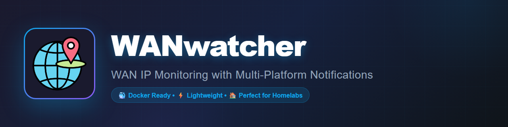

<div align="center">



# WANwatcher

Monitors your WAN IPv4/IPv6 addresses and tells you when they change.

[](https://hub.docker.com/r/noxied/wanwatcher)
[](https://hub.docker.com/r/noxied/wanwatcher)
[](https://github.com/noxied/wanwatcher/releases)
[](https://github.com/noxied/wanwatcher)
[](LICENSE)

</div>

WANwatcher is a small Docker container that periodically checks your public IPv4 and IPv6 addresses against several detection services. When an address changes it can notify you (Discord, Telegram, email, or anything Apprise supports), update DNS records (Cloudflare, DuckDNS, dyndns2), publish the state over MQTT for Home Assistant, and expose a status API with Prometheus metrics. It is aimed at homelabs and small servers on residential connections where the ISP changes your IP whenever it feels like it.

## Features

- IPv4 and IPv6 monitoring, each can be turned off independently
- Multiple IP detection sources, tried in rotating order so one broken service never blocks detection
- Change confirmation: a new IP is verified against a second source before you get notified
- Notifications via Discord webhooks, Telegram bots, SMTP email, and Apprise (100+ services: ntfy, Gotify, Pushover, Slack, Matrix, ...)
- Built-in dynamic DNS updates for Cloudflare, DuckDNS, and any dyndns2-compatible provider (No-IP, Dynu, ...)
- HTTP status API with `/healthz`, `/api/status`, and Prometheus `/metrics`
- MQTT publishing with Home Assistant auto-discovery
- Startup notice, optional heartbeat, and internet outage detection with a recovery notification
- Optional geographic info for the new IP via ipinfo.io
- Graceful shutdown on SIGTERM, atomic state file writes, retries with backoff, change history in the state file
- Runs as a non-root user (uid 1000), multi-arch image (AMD64 and ARM64)

## Quick start

You need at least one notification method enabled. The minimal Discord setup:

```bash
docker run -d \
  --name wanwatcher \
  --restart unless-stopped \
  -e DISCORD_ENABLED="true" \
  -e DISCORD_WEBHOOK_URL="https://discord.com/api/webhooks/YOUR_ID/YOUR_TOKEN" \
  -e SERVER_NAME="My Server" \
  -v ./data:/data \
  -v ./logs:/logs \
  noxied/wanwatcher:2.0.0
```

Or with compose:

```yaml
services:
  wanwatcher:
    image: noxied/wanwatcher:2.0.0
    container_name: wanwatcher
    restart: unless-stopped
    environment:
      SERVER_NAME: "My Server"
      CHECK_INTERVAL: "900"
      DISCORD_ENABLED: "true"
      DISCORD_WEBHOOK_URL: "https://discord.com/api/webhooks/YOUR_ID/YOUR_TOKEN"
    volumes:
      - ./data:/data
      - ./logs:/logs
```

Note: the container runs as uid 1000, so the host directories mounted on `/data` and `/logs` must be writable by that user:

```bash
mkdir -p data logs
sudo chown -R 1000:1000 data logs
```

The repository's [docker-compose.yml](docker-compose.yml) lists every option with comments.

## Configuration

Everything is configured through environment variables. Booleans are the string `"true"` (anything else means false). Lists are comma separated.

### General

| Variable | Default | Description |
|----------|---------|-------------|
| `SERVER_NAME` | `WANwatcher Docker` | Name shown in notifications |
| `BOT_NAME` | `WANwatcher` | Display name used by notifiers |
| `CHECK_INTERVAL` | `900` | Seconds between IP checks |
| `MONITOR_IPV4` | `true` | Monitor the public IPv4 address |
| `MONITOR_IPV6` | `true` | Monitor the public IPv6 address |
| `IP_CHANGE_CONFIRMATION` | `true` | Confirm a detected change with a second source before acting on it |
| `IPINFO_TOKEN` | (empty) | Optional ipinfo.io token for geographic data |
| `HTTP_TIMEOUT` | `10` | Timeout in seconds for outbound HTTP requests |
| `IP_DB_FILE` | `/data/ipinfo.db` | State file path |
| `LOG_FILE` | `/logs/wanwatcher.log` | Log file path |

### Discord

| Variable | Default | Description |
|----------|---------|-------------|
| `DISCORD_ENABLED` | `false` | Enable Discord notifications |
| `DISCORD_WEBHOOK_URL` | (empty) | Webhook URL |
| `DISCORD_AVATAR_URL` | (empty) | Optional custom avatar; the webhook's own avatar is used when empty |

### Telegram

| Variable | Default | Description |
|----------|---------|-------------|
| `TELEGRAM_ENABLED` | `false` | Enable Telegram notifications |
| `TELEGRAM_BOT_TOKEN` | (empty) | Bot token from @BotFather |
| `TELEGRAM_CHAT_ID` | (empty) | Chat or channel id |
| `TELEGRAM_PARSE_MODE` | `HTML` | `HTML` or `Markdown` |

### Email (SMTP)

| Variable | Default | Description |
|----------|---------|-------------|
| `EMAIL_ENABLED` | `false` | Enable email notifications |
| `EMAIL_SMTP_HOST` | (empty) | SMTP server, e.g. `smtp.gmail.com` |
| `EMAIL_SMTP_PORT` | `587` | 587 for TLS, 465 for SSL |
| `EMAIL_SMTP_USER` | (empty) | SMTP username |
| `EMAIL_SMTP_PASSWORD` | (empty) | SMTP password (use an app password for Gmail) |
| `EMAIL_FROM` | (empty) | Sender address |
| `EMAIL_TO` | (empty) | Recipients, comma separated |
| `EMAIL_USE_TLS` | `true` | STARTTLS |
| `EMAIL_USE_SSL` | `false` | Implicit SSL (do not enable both TLS and SSL) |
| `EMAIL_SUBJECT_PREFIX` | `[WANwatcher]` | Subject prefix |

### Apprise

| Variable | Default | Description |
|----------|---------|-------------|
| `APPRISE_ENABLED` | `false` | Enable Apprise notifications |
| `APPRISE_URLS` | (empty) | Comma-separated Apprise URLs |

### Dynamic DNS

| Variable | Default | Description |
|----------|---------|-------------|
| `DDNS_ENABLED` | `false` | Enable DNS updates on IP change |
| `DDNS_PROVIDER` | (empty) | `cloudflare`, `duckdns`, or `dyndns2` |
| `CLOUDFLARE_API_TOKEN` | (empty) | API token with Zone.DNS edit permission |
| `CLOUDFLARE_ZONE` | (empty) | Zone name, e.g. `example.com` |
| `CLOUDFLARE_RECORDS` | (empty) | Records to update, e.g. `home.example.com,vpn.example.com` |
| `CLOUDFLARE_PROXIED` | `false` | Whether updated records go through the Cloudflare proxy |
| `CLOUDFLARE_TTL` | `1` | Record TTL; 1 means automatic |
| `DUCKDNS_TOKEN` | (empty) | DuckDNS account token |
| `DUCKDNS_DOMAINS` | (empty) | Subdomain names, comma separated |
| `DYNDNS2_SERVER` | (empty) | Update server, e.g. `https://dynupdate.no-ip.com` |
| `DYNDNS2_USERNAME` | (empty) | Username |
| `DYNDNS2_PASSWORD` | (empty) | Password |
| `DYNDNS2_HOSTNAMES` | (empty) | Hostnames, comma separated |

### Status API

| Variable | Default | Description |
|----------|---------|-------------|
| `API_ENABLED` | `false` | Enable the HTTP status API |
| `API_BIND` | `0.0.0.0` | Bind address |
| `API_PORT` | `8080` | Port (remember to publish it) |

### MQTT

| Variable | Default | Description |
|----------|---------|-------------|
| `MQTT_ENABLED` | `false` | Enable MQTT publishing |
| `MQTT_HOST` | (empty) | Broker hostname |
| `MQTT_PORT` | `1883` | Broker port |
| `MQTT_USERNAME` | (empty) | Username |
| `MQTT_PASSWORD` | (empty) | Password |
| `MQTT_CLIENT_ID` | `wanwatcher` | Client id |
| `MQTT_TOPIC_PREFIX` | `wanwatcher` | Topic prefix |
| `MQTT_TLS` | `false` | TLS connection to the broker |
| `MQTT_HA_DISCOVERY` | `true` | Publish Home Assistant discovery configs |
| `MQTT_HA_DISCOVERY_PREFIX` | `homeassistant` | HA discovery prefix |

### Events

| Variable | Default | Description |
|----------|---------|-------------|
| `NOTIFY_ON_STARTUP` | `true` | Send a message when the container starts |
| `HEARTBEAT_ENABLED` | `false` | Periodic "still alive" message |
| `HEARTBEAT_INTERVAL` | `86400` | Seconds between heartbeats |
| `OUTAGE_DETECTION_ENABLED` | `true` | Notify when connectivity drops and when it returns |
| `OUTAGE_THRESHOLD` | `3` | Consecutive failed checks before declaring an outage |

### Update check

| Variable | Default | Description |
|----------|---------|-------------|
| `UPDATE_CHECK_ENABLED` | `true` | Check GitHub for new releases |
| `UPDATE_CHECK_INTERVAL` | `86400` | Seconds between checks |
| `UPDATE_CHECK_ON_STARTUP` | `true` | Also check at startup |

## Notifications

At least one notifier must be enabled or the container refuses to start.

### Discord

Create a webhook under Server Settings > Integrations > Webhooks and set `DISCORD_ENABLED=true` and `DISCORD_WEBHOOK_URL`. Messages are sent as embeds. To customize the avatar, set it on the webhook in Discord or point `DISCORD_AVATAR_URL` at a public image.

### Telegram

Create a bot with [@BotFather](https://t.me/BotFather), get your chat id (for example from [@userinfobot](https://t.me/userinfobot)), send `/start` to your bot once, then set `TELEGRAM_ENABLED`, `TELEGRAM_BOT_TOKEN`, and `TELEGRAM_CHAT_ID`.

### Email

Standard SMTP. For Gmail, enable 2FA and generate an app password, then:

```yaml
EMAIL_ENABLED: "true"
EMAIL_SMTP_HOST: "smtp.gmail.com"
EMAIL_SMTP_PORT: "587"
EMAIL_SMTP_USER: "you@gmail.com"
EMAIL_SMTP_PASSWORD: "your-app-password"
EMAIL_FROM: "you@gmail.com"
EMAIL_TO: "you@gmail.com"
```

### Apprise

One setting covers everything Apprise supports. Some example URLs:

```yaml
APPRISE_ENABLED: "true"
# ntfy topic
APPRISE_URLS: "ntfy://ntfy.sh/my-topic"
# multiple services, comma separated
# APPRISE_URLS: "pover://USER_KEY@APP_TOKEN,gotify://gotify.example.com/APP_TOKEN"
```

See the [Apprise URL list](https://github.com/caronc/apprise#supported-notifications) for every supported service.

## Dynamic DNS

When `DDNS_ENABLED=true`, WANwatcher updates your DNS records whenever the IP changes (and retries failed updates on the next check). One provider at a time, selected by `DDNS_PROVIDER`.

Cloudflare (token needs Zone.DNS edit permission for the zone):

```yaml
DDNS_ENABLED: "true"
DDNS_PROVIDER: "cloudflare"
CLOUDFLARE_API_TOKEN: "your-token"
CLOUDFLARE_ZONE: "example.com"
CLOUDFLARE_RECORDS: "home.example.com"
```

DuckDNS:

```yaml
DDNS_ENABLED: "true"
DDNS_PROVIDER: "duckdns"
DUCKDNS_TOKEN: "your-token"
DUCKDNS_DOMAINS: "myhome"
```

Generic dyndns2 (No-IP, Dynu, and most router-supported providers):

```yaml
DDNS_ENABLED: "true"
DDNS_PROVIDER: "dyndns2"
DYNDNS2_SERVER: "https://dynupdate.no-ip.com"
DYNDNS2_USERNAME: "user"
DYNDNS2_PASSWORD: "pass"
DYNDNS2_HOSTNAMES: "home.example.com"
```

## Status API

Set `API_ENABLED=true` and publish the port (`-p 8080:8080`). Endpoints:

- `GET /healthz` returns `{"status": "ok", ...}` when the loop is healthy
- `GET /api/status` returns the full state: current IPs, last check, last change, uptime
- `GET /metrics` returns Prometheus metrics

```bash
curl http://localhost:8080/api/status
curl http://localhost:8080/metrics
```

Exported metrics include `wanwatcher_checks_total`, `wanwatcher_check_failures_total`, `wanwatcher_ip_changes_total`, `wanwatcher_notifications_total`, `wanwatcher_ddns_updates_total`, `wanwatcher_last_change_timestamp_seconds`, `wanwatcher_last_check_timestamp_seconds`, and `wanwatcher_up`. A Prometheus scrape job pointed at `wanwatcher:8080` works as-is; no extra exporter needed.

When the API is enabled, the container healthcheck queries `/healthz`. Otherwise it verifies that the state file exists, is valid JSON, and was refreshed recently.

## MQTT and Home Assistant

With `MQTT_ENABLED=true` the current state is published as retained messages under the topic prefix (default `wanwatcher`):

- `wanwatcher/ipv4`, `wanwatcher/ipv6`, `wanwatcher/last_change`
- `wanwatcher/state` (JSON with IPs, geo data, and server name)
- `wanwatcher/availability` (`online`/`offline`, also set as the MQTT will)

With `MQTT_HA_DISCOVERY=true` (the default) Home Assistant discovery configs are published, so a device with WAN IPv4, WAN IPv6, and last-change sensors shows up automatically once HA is connected to the same broker.

## Events

Besides IP change notifications, WANwatcher can send:

- a startup notice when the container starts (`NOTIFY_ON_STARTUP`, on by default)
- a periodic heartbeat so you know the monitor itself is alive (`HEARTBEAT_ENABLED`, off by default)
- an outage notice after `OUTAGE_THRESHOLD` consecutive failed checks, and a recovery notice when connectivity returns (`OUTAGE_DETECTION_ENABLED`, on by default; the outage notice is delivered once the connection is back, since nothing can be sent during the outage)
- an update notice when a new WANwatcher release is available (`UPDATE_CHECK_ENABLED`)

## Upgrading from 1.x

All v1 environment variables keep working and the state file is migrated automatically. The one breaking change: the container now runs as uid 1000, so your `/data` and `/logs` volumes must be writable by that user (`sudo chown -R 1000:1000 ./data ./logs`). See [UPGRADING.md](UPGRADING.md) for details.

## Development

```bash
git clone https://github.com/noxied/wanwatcher.git
cd wanwatcher
pip install -r requirements-dev.txt

# tests
pytest tests/ -v --cov

# lint and format
black wanwatcher/ tests/
isort wanwatcher/ tests/
flake8 wanwatcher/
mypy wanwatcher/ --ignore-missing-imports

# run locally
python -m wanwatcher

# build the image
docker build -t wanwatcher:dev .
```

See [CONTRIBUTING.md](CONTRIBUTING.md) for guidelines, including how to add a notification or DDNS provider.

## Documentation

- [CHANGELOG.md](CHANGELOG.md) for version history
- [UPGRADING.md](UPGRADING.md) for upgrade instructions
- [docs/TROUBLESHOOTING.md](docs/TROUBLESHOOTING.md) for common problems
- [SECURITY.md](SECURITY.md) for the security policy

## License

MIT, see [LICENSE](LICENSE).
